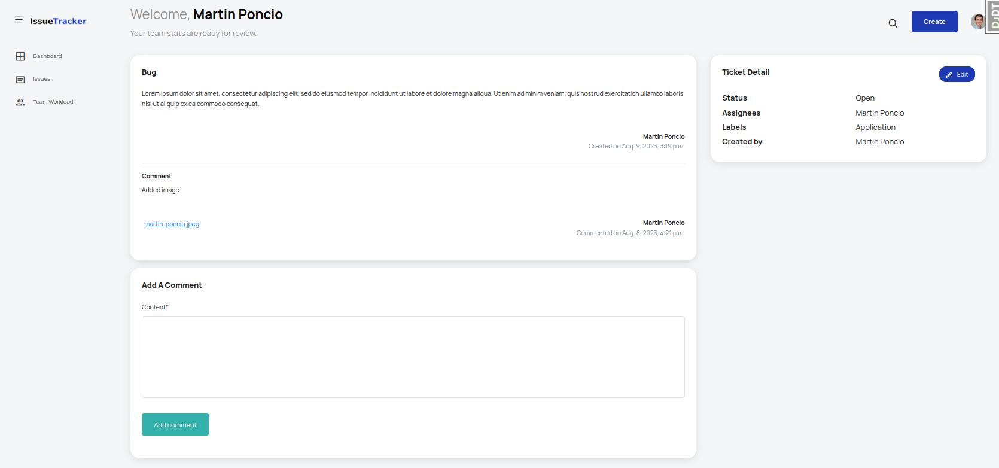
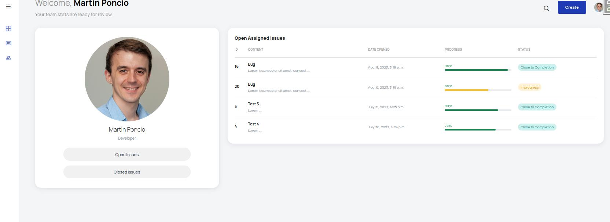
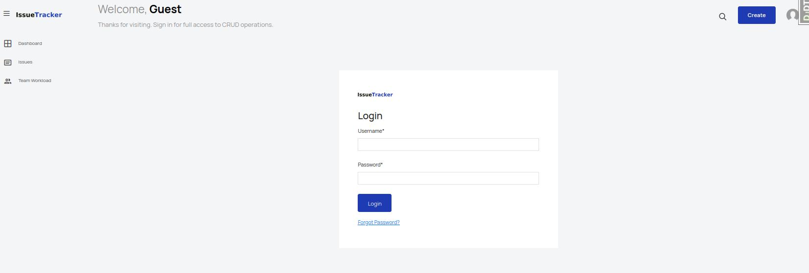
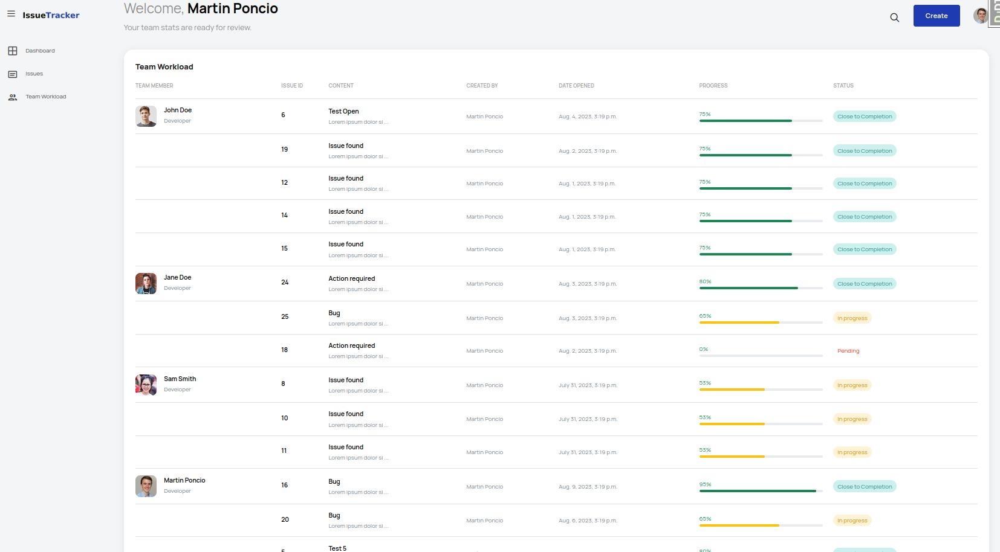

# Django-Issue-Tracker

The project SRS can be found [here](./SRS.md)

I worked on a different branch during each sprint so the work can be easily reviewed. You can find the branches [here](https://github.com/lmponcio/Django-Issue-Tracker/branches)

#### Skills
- Auth
- CRUD
- Sessions
- Signals
- CBV
- Model Forms
- Custom Middleware

#### Dashboard

#### Ticket/Issue detail view
It also contains a form for adding comments.

#### Profile profile view

#### Login form

#### Team workload view

