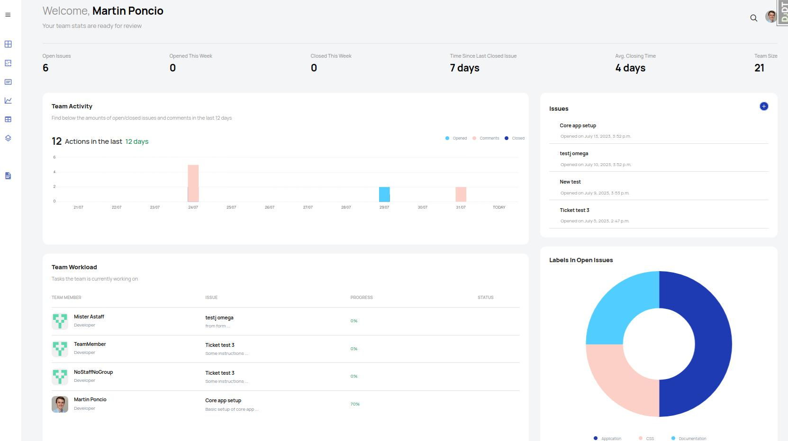

# Django-Issue-Tracker

I am currently working on branch features/pages/ui

Please find below a screenshot of the dashboard as it's currently looking:

The project SRS can be found [here](./SRS.md)

I have worked on a different branch for each sprint so the work can be easily reviewd. You can find the branches [here](https://github.com/lmponcio/Django-Issue-Tracker/branches)
